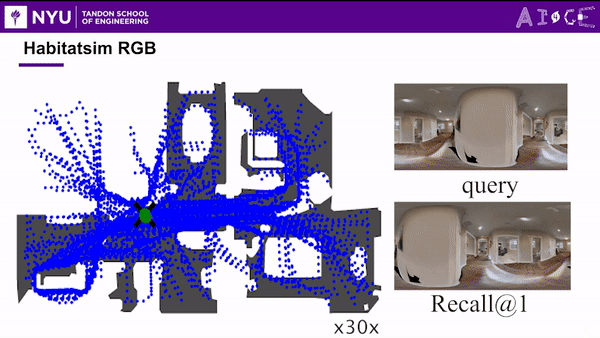
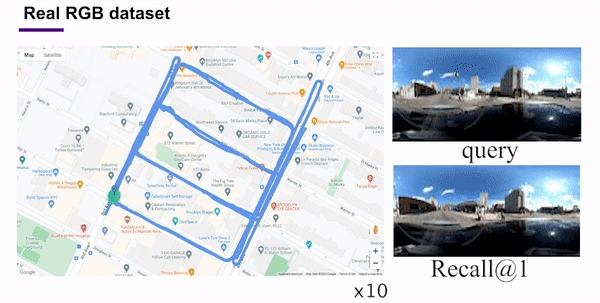

# Self-Supervised Visual Place Recognition by Mining Temporal and Feature Neighborhoods
[Chao Chen](https://scholar.google.com/citations?hl=en&user=WOBQbwQAAAAJ), [Xinhao Liu](https://gaaaavin.github.io), [Xuchu Xu](https://www.xuchuxu.com), [Li Ding](https://www.hajim.rochester.edu/ece/lding6/), [Yiming Li](https://scholar.google.com/citations?user=i_aajNoAAAAJ), [Ruoyu Wang](https://github.com/ruoyuwangeel4930), [Chen Feng](https://scholar.google.com/citations?user=YeG8ZM0AAAAJ)

**"A Novel self-supervised VPR model capable of retrieving positives from various orientations."**


[](https://svgshare.com/i/Zhy.svg)
[](https://github.com/Joechencc/TF-VPR)
[](https://github.com/Joechencc/TF-VPR/stargazers/)
<div align="center">
    
</div>
<br>

## Abstract

Visual place recognition (VPR) using deep networks has achieved state-of-the-art performance. However, most of the related approaches require a training set with ground truth sensor poses to obtain the positive and negative samples of each observation's spatial neighborhoods. When such knowledge is unknown, the temporal neighborhoods from a sequentially collected data stream could be exploited for self-supervision, although with suboptimal performance. Inspired by noisy label learning, we propose a novel self-supervised VPR framework that uses both the temporal neighborhoods and the learnable feature neighborhoods to discover the unknown spatial neighborhoods. Our method follows an iterative training paradigm which alternates between: (1) representation learning with data augmentation, (2) positive set expansion to include the current feature space neighbors, and (3) positive set contraction via geometric verification. We conduct comprehensive experiments on both simulated and real datasets, with input of both images and point clouds. The results demonstrate that our method outperforms the baselines in both recall rate, robustness, and a novel metric we proposed for VPR, the orientation diversity.

## Dataset

Download links:
-  For Pointcloud: Please refer to DeepMapping paper, https://github.com/ai4ce/PointCloudSimulator
-  For Real-world Panoramic RGB: https://drive.google.com/drive/u/0/folders/1ErXzIx0je5aGSRFbo5jP7oR8gPrdersO

You could find more detailed documents on our [website](https://github.com/Joechencc/TF-VPR/edit/RGB_supervise/README.md)!

TF-VPR follows the same file structure as the [PointNetVLAD](https://github.com/mikacuy/pointnetvlad):
```
TF-VPR
├── loss # loss function
├── models # network model
|   ├── PointNetVlad.py # PointNetVLAD network model
|   ├── ImageNetVlad.py # NetVLAD network model 
|   ...
├── generating_queries # Preprocess the data, initial the label, and generate Pickle file 
|   ├── generate_test_RGB_sets.py # Generate the test pickle file
|   ├── generate_training_tuples_RGB_baseline_batch.py # Generate the train pickle file
|   ...
├── results # Results are saved here
├── config.py # Config file
├── evaluate.py # evaluate file
├── loading_pointcloud.py # file loading script
├── train_pointnetvlad.py # Main file to train TF-VPR
|   ...
```
Point cloud TF-VPR result:


RGB TF-VPR result:



Real-world RGB TF-VPR result:



# Note

I kept almost everything not related to tensorflow as the original implementation.
The main differences are:
* Multi-GPU support
* Configuration file (config.py)
* Evaluation on the eval dataset after every epochs

### Pre-Requisites
- PyTorch 0.4.0
- tensorboardX
- open3d-python 0.4
- scipy
- matplotlib
- numpy

### Generate pickle files
```
cd generating_queries/

# For training tuples in our baseline network
python generate_training_tuples_RGB_baseline_batch.py

# For network evaluation
python generate_test_RGB_sets.py
```

### Train
```
python train_pointnetvlad.py
```

### Evaluate
```
python evaluate.py
```

Take a look at train_pointnetvlad.py and evaluate.py for more parameters

## Benchmark

We implement SPTM, TF-VPR, and supervise version, please check the other branches for reference

<!-- ## Citation

If you find TF-VPR useful in your research, please cite:

```bibtex
@article{Chen_2022_RAL,
    title = {Self-Supervised Visual Place Recognition by Mining Temporal and Feature Neighborhoods},
    author = {Chen, Chao and Liu, Xinhao and Xu, Xuchu and Ding, Li and Li, Yiming and Wang, Ruoyu and Feng, Chen},
    booktitle = {IEEE Robotics and Automation Letters},
    year = {2022} 
}
``` -->
