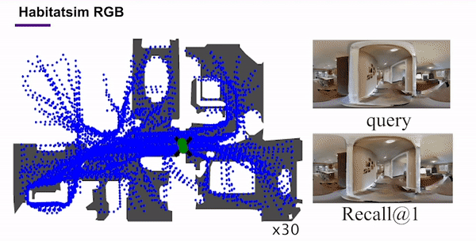

# Self-Supervised Visual Place Recognition by Mining Temporal and Feature Neighborhoods
[Chao Chen](https://scholar.google.com/citations?hl=en&user=WOBQbwQAAAAJ), [Xinhao Liu](https://gaaaavin.github.io), [Xuchu Xu](https://www.xuchuxu.com), [Li Ding](https://www.hajim.rochester.edu/ece/lding6/), [Yiming Li](https://scholar.google.com/citations?user=i_aajNoAAAAJ), [Ruoyu Wang](https://github.com/ruoyuwangeel4930), [Chen Feng](https://scholar.google.com/citations?user=YeG8ZM0AAAAJ)

**"A Novel self-supervised VPR model capable of retrieving positives from various orientations."**


[](https://svgshare.com/i/Zhy.svg)
[](https://github.com/Joechencc/TF-VPR)
[](https://github.com/Joechencc/TF-VPR/stargazers/)
<div align="center">
    
</div>
<br>

## Abstract

Visual place recognition (VPR) using deep networks has achieved state-of-the-art performance. However, most of the related approaches require a training set with ground truth sensor poses to obtain the positive and negative samples of each observation's spatial neighborhoods. When such knowledge is unknown, the temporal neighborhoods from a sequentially collected data stream could be exploited for self-supervision, although with suboptimal performance. Inspired by noisy label learning, we propose a novel self-supervised VPR framework that uses both the temporal neighborhoods and the learnable feature neighborhoods to discover the unknown spatial neighborhoods. Our method follows an iterative training paradigm which alternates between: (1) representation learning with data augmentation, (2) positive set expansion to include the current feature space neighbors, and (3) positive set contraction via geometric verification. We conduct comprehensive experiments on both simulated and real datasets, with input of both images and point clouds. The results demonstrate that our method outperforms the baselines in both recall rate, robustness, and a novel metric we proposed for VPR, the orientation diversity.

## Dataset

Download links:
-  For Pointcloud: Please refer to DeepMapping paper, https://github.com/ai4ce/PointCloudSimulator
-  For NYU-VPR-360 dataset: https://drive.google.com/drive/u/0/folders/1ErXzIx0je5aGSRFbo5jP7oR8gPrdersO

You could find more detailed documents on our [website](https://github.com/Joechencc/TF-VPR/edit/PCL_SPTM/README.md)!

# Data Structure
```
Data_folder
├── 000001.pcd or 000001.RGB # Dataset
├── 000002.pcd or 000002.RGB # Dataset
|   ...
├── 00nnnn.pcd or 00nnnn.RGB # Dataset
├── gt_pose.mat # ground truth mat file contains the geographical information for evaluation
```

## Folder Structure

TF-VPR follows the same file structure as the [PointNetVLAD](https://github.com/mikacuy/pointnetvlad):
```
TF-VPR
├── loss # loss function
├── models # network model
|   ├── PointNetVlad.py # PointNetVLAD network model
|   ├── ImageNetVLAD.py # NetVLAD network model 
|   ├── resnet_mod.py # ResNet network model 
|   ├── Verification_PCL.py # Verification for PCL data
|   ├── Verification_RGB.py # Verification for RGB data
|   ├── Verification_RGB_real.py # Verification for RGB_real data
|   ...
├── generating_queries # Preprocess the data, initial the label, and generate Pickle file 
|   ├── generate_test_PCL_baseline_sets.py # Generate the test pickle file for PCL baseline
|   ├── generate_test_PCL_ours_sets.py # Generate the test pickle file for PCL TF-VPR
|   ├── generate_test_PCL_supervise_sets.py # Generate the test pickle file for PCL supervise
|   ├── generate_test_RGB_baseline_sets.py # Generate the test pickle file for Habitat-sim baseline
|   ├── generate_test_RGB_ours_sets.py # Generate the test pickle file for Habitat-sim TF-VPR
|   ├── generate_test_RGB_supervise_sets.py # Generate the test pickle file for Habitat-sim supervise
|   ├── generate_test_RGB_real_baseline_sets.py # Generate the test pickle file for NYU-VPR-360 baseline
|   ├── generate_test_RGB_real_ours_sets.py # Generate the test pickle file for NYU-VPR-360 TF-VPR
|   ├── generate_test_RGB_real_supervise_sets.py # Generate the test pickle file for NYU-VPR-360 supervise
|   ├── generate_training_tuples_PCL_baseline.py # Generate the train pickle file for PCL baseline
|   ├── generate_training_tuples_PCL_ours.py # Generate the train pickle file for PCL TF-VPR
|   ├── generate_training_tuples_PCL_supervise.py # Generate the train pickle file for PCL supervise
|   ├── generate_training_tuples_RGB_baseline.py # Generate the train pickle file for Habitat-sim baseline
|   ├── generate_training_tuples_RGB_ours.py # Generate the train pickle file for Habitat-sim TF-VPR
|   ├── generate_training_tuples_RGB_supervise.py # Generate the train pickle file for Habitat-sim supervise
|   ├── generate_training_tuples_RGB_supervise.py # Generate the train pickle file for NYU-VPR-360 baseline
|   ├── generate_training_tuples_RGB_real_ours.py # Generate the train pickle file for NYU-VPR-360 TF-VPR
|   ├── generate_training_tuples_RGB_real_supervise.py # Generate the train pickle file for NYU-VPR-360 supervise
|   ...
├── results # Results are saved here
├── config.py # Config file
├── evaluate.py # evaluate file
├── loading_pointcloud.py # file loading script
├── train_pointnetvlad_PCL_baseline.py # Main file to train PCL baseline
├── train_pointnetvlad_PCL_ours.py # Main file to train PCL TF-VPR
├── train_pointnetvlad_PCL_supervise.py # Main file to train PCL supervise
├── train_netvlad_RGB_baseline.py # Main file to train Hatbitat-sim baseline
├── train_netvlad_RGB_ours.py # Main file to train Hatbitat-sim TF-VPR
├── train_netvlad_RGB_supervise.py # Main file to train Hatbitat-sim supervise
├── train_netvlad_RGB_real_baseline.py # Main file to train NYU-VPR-360 baseline
├── train_netvlad_RGB_real_ours.py # Main file to train NYU-VPR-360 TF-VPR
├── train_netvlad_RGB_real_supervise.py # Main file to train NYU-VPR-360 supervise
|   ...
```
Point cloud TF-VPR result:


RGB TF-VPR result:



Real-world RGB TF-VPR result:


# Note

I kept almost everything not related to tensorflow as the original implementation. You can check each method for each branch
The main differences are:
* Multi-GPU support
* Configuration file (config.py)
* Evaluation on the eval dataset after every epochs

### Pre-Requisites
- Python 3.6
- PyTorch >=1.10.0
- tensorboardX
- open3d-python 0.4
- scipy
- matplotlib
- numpy
- pandas
- scikit-learn
- pickle5
- torchvision
- opencv-contrib-python

### Generate pickle files
```
cd generating_queries/
### For Pointcloud data

# To create pickle file for PCL baseline method
python generate_training_tuples_PCL_baseline.py

# To create pickle file for PCL TF-VPR method
python generate_training_tuples_PCL_ours.py

# To create pickle file for PCL supervise method
python generate_training_tuples_PCL_supervise.py

# To create pickle file for PCL baseline evaluation pickle
python generate_test_PCL_baseline_sets.py

# To create pickle file for PCL TF-VPR evaluation pickle
python generate_test_PCL_ours_sets.py

# To create pickle file for PCL supervise evaluation pickle
python generate_test_PCL_supervise_sets.py
```

```
cd generating_queries/
### For Habitat-sim data

# For training tuples in our RGB baseline network 
python generate_training_tuples_RGB_baseline.py

# For training tuples in our RGB baseline network 
python generate_training_tuples_RGB_ours.py

# For training tuples in our RGB baseline network 
python generate_training_tuples_RGB_supervise.py

# For RGB network evaluation
python generate_test_RGB_baseline_sets.py

# For RGB network evaluation
python generate_test_RGB_ours_sets.py

# For RGB network evaluation
python generate_test_RGB_supervise_sets.py
```

```
cd generating_queries/
### For NYU-VPR-360 data

# For training tuples in our RGB baseline network 
python generate_training_tuples_RGB_real_baseline.py

# For training tuples in our RGB baseline network 
python generate_training_tuples_RGB_real_ours.py

# For training tuples in our RGB baseline network 
python generate_training_tuples_RGB_real_supervise.py

# For RGB network evaluation
python generate_test_RGB_baseline_real_sets.py

# For RGB network evaluation
python generate_test_RGB_real_ours_sets.py

# For RGB network evaluation
python generate_test_RGB_real_supervise_sets.py
```

### Verification threshold
```
### For point cloud

python Verification_PCL.py # you can create max and min threshold using this command. For RGB, we calculate the threshold on Verification stage, no need to precalculate
```

### Train
```
### For point cloud

python train_pointnetvlad_PCL_baseline.py       # Train baseline for PCL data
python train_pointnetvlad_PCL_ours.py           # Train ours for PCL data       
python train_pointnetvlad_PCL_supervise.py      # Train supervise for PCL data

### For Habitat-sim

python train_pointnetvlad_RGBL_baseline.py      # Train baseline for Habitat-sim data
python train_pointnetvlad_RGB_ours.py           # Train ours for Habitat-sim data    
python train_pointnetvlad_RGB_supervise.py      # Train supervise for Habitat-sim data

### For point cloud

python train_pointnetvlad_RGB_real_baseline.py  # Train baseline for NYU-VPR-360 data
python train_pointnetvlad_RGB_real_ours.py      # Train baseline for NYU-VPR-360 data
python train_pointnetvlad_RGB_real_supervise.py # Train baseline for NYU-VPR-360 data
```

### Evaluate (You don't need to run it separately. For every epoch, evaluation will be run automatically)
```
python evaluate.py
```

Take a look at train_pointnetvlad.py and evaluate.py for more parameters

## Benchmark

We implement SPTM, TF-VPR, and supervise version, please check the other branches for reference

<!-- ## Citation

If you find TF-VPR useful in your research, please cite:

```bibtex
@article{Chen_2022_RAL,
    title = {Self-Supervised Visual Place Recognition by Mining Temporal and Feature Neighborhoods},
    author = {Chen, Chao and Liu, Xinhao and Xu, Xuchu and Ding, Li and Li, Yiming and Wang, Ruoyu and Feng, Chen},
    booktitle = {IEEE Robotics and Automation Letters},
    year = {2022} 
}
``` -->
